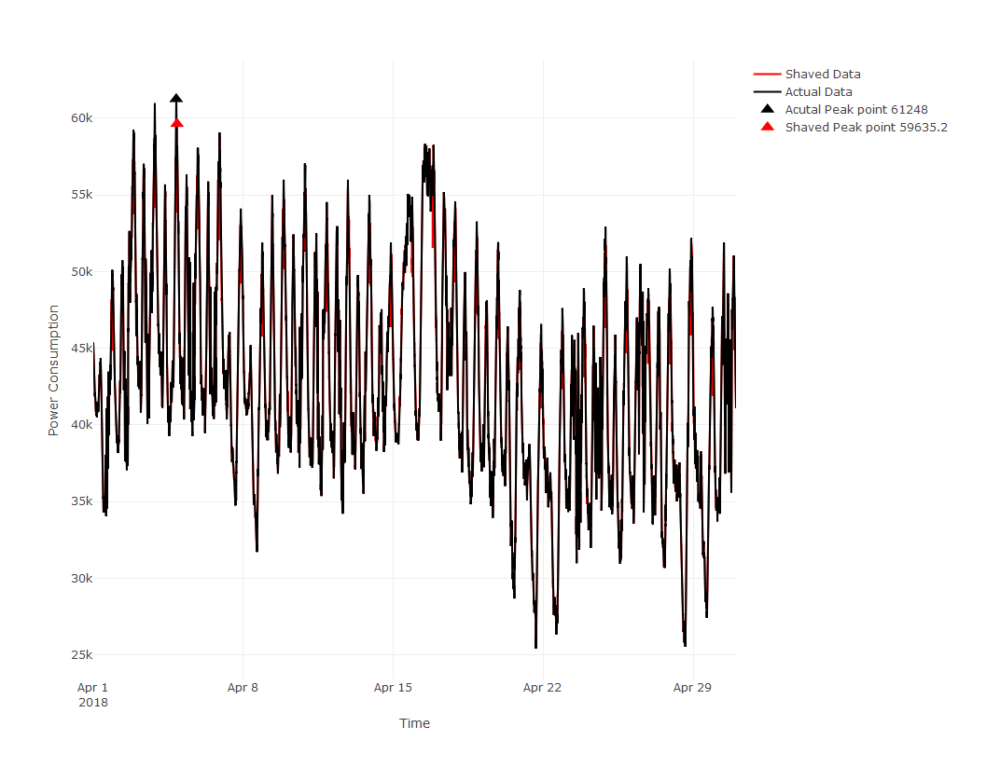

---
date: `r format(as.Date("2021-04-01"), "%Y-%B")`
---
```{r echo=FALSE,warning=FALSE,message=FALSE, results='hide', fig.show='hide'}
require("keras")
require("jsonlite")
require("lubridate")
require("htmlwidgets")
require("plotly")
require("RMySQL")
require("RODBC")
require("tidyverse")
require("DMwR")
require("zoo")
require("ggplot2")
require("mailR")
require("recipes")
require("dplyr")
library(htmlwidgets)
library(lubridate)
library(Cubist)
library(caTools)
library(rpart)
library (dplyr)
library(caret)
library(rpart.plot)
library(reticulate)
library(readr)
library(plotly)
library(stringr)
library(keras)
library(recipes)
library(xgboost)
library(h2o)
library(hrbrthemes)
library(chron)
library(Metrics)
library(scales)
library(zoo)
library('dplyr')
if(!require(philentropy)){
  install.packages("philentropy")
  library(philentropy)
}
if(!require(webshot)){
  install.packages("webshot")
  webshot::install_phantomjs()
  library(webshot)
}
h2o.init(nthreads=-1, max_mem_size="2G")
setwd("D:/Hydro-prediction-System/ui")


data <- read.csv("total_dataset.csv", header=TRUE, sep=",", na.strings=c("NA", "NULL"),stringsAsFactors=FALSE)
scale_data<-scale(data$fwts)
data$fwts<-scale(data$fwts)
source('Make_prediction.R')
source('Monthly.R')
source("plot_function.R")
source("report_function.r")
battery_size<-4000
l_of_p<-make_prediction_monthly(params$report_month,"fwts")
monthreport_shaved<-ifelse(!is.na(l_of_p$peak_period),l_of_p$test-battery_size,l_of_p$test)

peak_period<-l_of_p$peak_period
low_peak_period<- l_of_p$low_peak_period
normal_period<-l_of_p$normal_period
success<-!l_of_p$hours[which.max(monthreport_shaved)]==l_of_p$xcoord_list$test
  #l_of_p$hours[which.max(monthreport_shaved)]==l_of_p$xcoord_list$test


highest<-l_of_p$hours[l_of_p$test==l_of_p$ymax_list]

dayreport<-make_prediction_testing(as.Date(highest),"fwts")
#dayreport
#daily_plot_simple(dayreport)

gap<-25
low_peak <-
  dayreport$hours[which.min(dayreport$AVG)]


charging_range <- interval(dayreport$xcoord_list$mean_s-gap*60, dayreport$xcoord_list$mean_s+gap*60)
peak_period<-ifelse(dayreport$hours %within% charging_range , dayreport$AVG, NA)
charging_range <- interval(dayreport$xcoord_list$mean_s-gap*60+300, dayreport$xcoord_list$mean_s+gap*60-300)
#make range smaller to remove the gap between normal period and peak period

discharging_range <- interval(low_peak-gap*60, low_peak+gap*60)
low_peak_period<-ifelse(dayreport$hours %within% discharging_range , dayreport$AVG, NA)
discharging_range <- interval(low_peak-gap*60+300, low_peak+gap*60-300)


dayreport_shaved<-ifelse(dayreport$hours %within% charging_range,dayreport$test-battery_size,dayreport$test)

#report_image(params$report_month)
```

# Overview
This monthly report analyzes the Peak Shaving system of Fort William TS power station during 2018-April. This report contains four sections: First, the graphical results of peak shaving activities of power consumption. Second, the numerical results peak shaving activities of power consumption and expected bill saving. Third, the monthly performance of energy forecasting models. Four, detailed peak shaving activities of the highest five peak days during this month. 


# The graphical results of Peak Shaving
Figure (\ref{fig:fig1}) shows a monthly forecasting graph. The black line describes the actual power consumption curve; the red line describes the prediction curve and the yellow line describes the battery discharging period set by the predicted peak.
```{r fig1,fig.cap = "Monthly forecasting graph\\label{fig1}",echo=FALSE,message=FALSE, fig.align = "default", out.width='100%',fig.pos="H"}


```


Figure (\ref{fig:fig2}) shows a comparison of the expected power consumption curve(black) and after the peak-shaving curve(red). According to figure (\ref{fig:fig2}), `r if(success){sprintf("The highest peak of power consumption of the month is reduced from <span style='color:red'>%s</span>kW (<span style='color:blue'>%s</span>) to <span style='color:red'> %s</span>kW (<span style='color:blue'> %s</span>).",format(l_of_p$ymax_list$test, scientific=FALSE),l_of_p$xcoord_list$test,format(max(monthreport_shaved),scientific=FALSE),l_of_p$hours[which.max(monthreport_shaved)])}else{sprintf("The highest peak of power consumption of the month remains <span style='color:red'>%s</span>kW (<span style='color:blue'>%s</span>).",format(l_of_p$ymax_list$test, scientific=FALSE),l_of_p$xcoord_list$test)}` Figure (\ref{fig:fig3}) shows the detailed peak shaving result of the highest peak of the month which is in 2018-04-04.
```{r fig2,fig.cap = "Monthly Peak Shaving Activies graph\\label{fig2}",echo=FALSE, out.width='100%',fig.pos="H"}

```

```{r fig3,fig.cap = "Highest peak day\\label{fig3}",echo=FALSE, out.width='100%',fig.pos="H"}

```


# The digital results of Peak shaving:
As shown in Table (\ref{tab:table1}), `r if(success){sprintf("the expected peak of power consumption is <span style='color:red'>%s</span>kW occur at <span style='color:blue'>%s</span>. After the peak-shaving activities, the highest peak of this month reduces to <span style='color:red'> %s</span>kW at <span style='color:blue'> %s</span>. The monthly energy purchasing cost reduces from $<span style='color:red'>%s</span> to $<span style='color:red'>%s</span>, which saves $<span style='color:red'>%s</span>.",format(l_of_p$ymax_list$test, scientific=FALSE),l_of_p$xcoord_list$test,format(max(monthreport_shaved),scientific=FALSE),l_of_p$hours[which.max(monthreport_shaved)],format(l_of_p$ymax_list$test/2, scientific=FALSE),format(max(monthreport_shaved)/2, scientific=FALSE),format((l_of_p$ymax_list$test-max(monthreport_shaved))/2, scientific=FALSE))}else{sprintf("The peak of power consumption remains <span style='color:red'>%s</span>kW occur at <span style='color:blue'>%s</span>. After the peak-shaving activities, the highest peak is not been reduced. The monthly energy purchasing cost is $<span style='color:red'>%s</span>. The detailed situation is in Section 2: The results of Peak Shaving.",format(l_of_p$ymax_list$test),l_of_p$xcoord_list$test,format(l_of_p$ymax_list$test/2, scientific=FALSE))}`
```{r table1,table.cap = "Monthly Results Table\\label{table1}",echo=FALSE, out.width='100%',fig.pos="H"}

monthly_table<-as.data.frame(c("Power Consumption(kW)", "Billing($)"))
monthly_table$Expected_Peak_of_the_Month<-c(format(l_of_p$ymax_list$test, scientific=FALSE),format(l_of_p$ymax_list$test/2, scientific=FALSE))
monthly_table$Shaved_Peak_of_the_Month<-c(format(max(monthreport_shaved),scientific=FALSE),format(max(monthreport_shaved)/2,scientific=FALSE))
monthly_table$Total_Reduction<-c(l_of_p$ymax_list$test-max(monthreport_shaved),(l_of_p$ymax_list$test-max(monthreport_shaved))/2)
colnames(monthly_table)<-c('Parameter', paste(format(as.Date(params$report_month), "%B"),' Expected Peak',sep=""), paste(format(as.Date(params$report_month), "%B"),' Shaved Peak',sep=""),"Total Reduction")
knitr::kable(monthly_table,digits = 2,caption = "Monthly Results Table")

```

# The performance of the forecasting system:
In this energy forecasting system, we combine four different models. Table (\ref{tab:table2)) show the monthly performance of each model. There are four machine learning algorithms in total: Cubist, Xgboost, (feedforward) Neural Network and LSTM (Long short-term memory). The ensemble model combines all four algorithms and battery discharging events base on the ensemble model. 

Relative root mean square error (rRMSE), which is RMSE divided by the average power consumption of tested day, between 1:00 pm to 12:00 pm to represent the performance of a model on the ability of prediction peak period. In the following formula, n represent number of data between 1:00 pm to 12:00 pm, y~i~ and x~i~ are the prediction and real power consumption receptively.

\begin{align}
rRMSE = \frac{1\sqrt{(\frac{1}{n})\sum_{i=1}^{n}(y_{i} - x_{i})^{2}}}{\frac{1}{n}\sum_{i=1}^{n}x_{i}}
\end{align}

Average Peak time error represent the mean of daily time different of expected peak time and predicted peak time. Pecentage of daily peak shaved represent the pecentage of days which discharging period coverd actual peak time in this month. For example, 0.8 mean this peak shaving system successfully shaved 80% of daily peak in this month.
```{r table2,table.cap = "Monthly Models Performance\\label{table2}",echo=FALSE, out.width='100%',fig.pos="H"}
date<-as.Date('2018-04-01')
m<-format(date,"%m")
list_of_prediction<-make_prediction_testing(date,"fwts")
result_list<-list_of_prediction$results

while(format(date,"%m")==m){#set up the training end

  list_of_prediction<-make_prediction_testing(date,"fwts")
  result_list<-rbind(result_list,list_of_prediction$results)
  date<-date+1  
}

#parameter, Cubist , Xgboost, Random Forest, Nerual Network, Ensemble System


result_table<-as.data.frame(c("rRMSE","Average Peak time error", "percentage of daily peak shaved"))
result_table$Cubist<-c(mean(result_list$RMSE_cubist),mean(abs(result_list$Peak_dif_cubist)),mean(abs(result_list$Peak_dif_cubist)<30))
result_table$xgboost<-c(mean(result_list$RMSE_xgboost),mean(abs(result_list$Peak_dif_xgboost)),mean(abs(result_list$Peak_dif_xgboost)<30))
result_table$RF<-c(mean(result_list$RMSE_RF),mean(abs(result_list$Peak_dif_RF)),mean(abs(result_list$Peak_dif_RF)<30))
result_table$NN<-c(mean(result_list$RMSE_NN),mean(abs(result_list$Peak_dif_NN)),mean(abs(result_list$Peak_dif_NN)<30))
result_table$LSTM<-c(mean(result_list$RMSE_LSTM),mean(abs(result_list$Peak_dif_LSTM)),mean(abs(result_list$Peak_dif_LSTM)<30))
result_table$AVG<-c(mean(result_list$RMSE_AVG),mean(abs(result_list$Peak_dif_mean_s)),mean(abs(result_list$Peak_dif_mean_s)<30))
colnames(result_table)<-c('Parameter', 'Cubist' , 'Xgboost', 'Random Forest', 'Nerual Network',"LSTM", 'Ensemble System')
knitr::kable(result_table,digits = 2,caption = "Monthly Models Performance")

```
The accuracy of energy forecasting on the highest peak of the month is an important factor to measure the performance of each model. Figure (\ref{fig:fig4}) show the performance of each model on the day with highest peak.
```{r fig4,fig.cap = "Daily Models Performance\\label{fig4}",echo=FALSE, out.width='100%',fig.pos="H"}

```
# Detailed report:
Top five highest peak days are shown in Figure (\ref{fig:day1})(\ref{fig:day2}) respectively.
```{r day1,fig.cap = "Highest Peak day\\label{day1}",echo=FALSE,message=FALSE, out.width='100%'}

```
```{r day2,fig.cap = "2nd Highest Peak day\\label{day2}",echo=FALSE,message=FALSE, out.width='100%'}


```

```{r day3,fig.cap = "3rd Highest Peak day\\label{day3}",echo=FALSE,message=FALSE, out.width='100%'}


```

```{r day4,fig.cap = "4th Highest Peak day\\label{day4}",echo=FALSE,message=FALSE, out.width='100%'}


```

```{r day5,fig.cap = "5th Highest Peak day\\label{day5}",echo=FALSE,message=FALSE, out.width='100%'}


```

